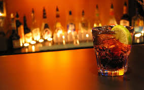
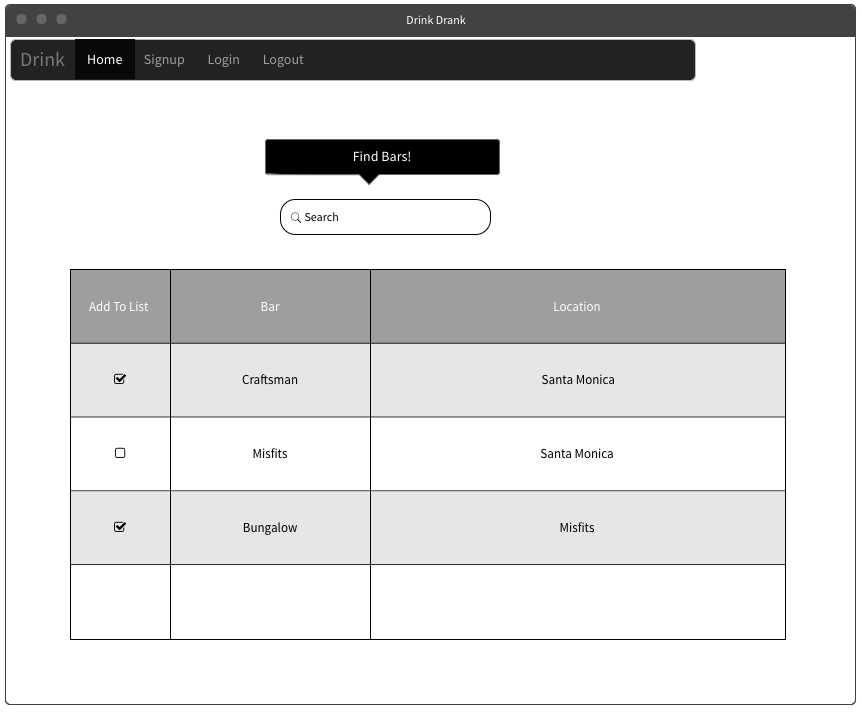

# DRINK/DRANK L.A.®

## INTRODUCTION

Do you know what time it is? It's time for a drink!

**DRINK/DRANK L.A.®** connects thirsty customers with their favorite drinking establishments in Los Angeles and beyond.

We encourage everyone to keep a running list of their favorite bars in the city, but to always be on the lookout for new ones, too. This app allows you to do both! Huzzah!

You and your friends can use **DRINK/DRANK L.A.®** to keep track of your favorite bars and have a system in place to keep the ones you are interested in on your radar.

Just remember to drink responsibly. Cheers!

## INCEPTION DECK

[Link to Google Slides](https://docs.google.com/presentation/d/1uxT85MbGpy_QfKzctI9AatGsZRO34L84ZMVZXQwaQFs/edit?usp=sharing)

## TECH USED

* MEN Stack
* AJAX
* JavaScript
* JQuery
* 3rd Party API

## APPROACH

We created two models--one for Users and one for Bars--that contain all of the information necessary to liaise between users and bars they will frequent. These models manage our users' data and databases.

## TRELLO PAGE

[Click here for Trello boards work flow](https://trello.com/b/4enMQKYM/project-3)

## UNSOLVED PROBLEMS

We would like the user to be able to search according to specific search parameters(i.e., price, zip code, etc).

## INSTALLATION INSTRUCTIONS

## MVP

* Have a working Facebook OAuth for users to log on and log off
* Allow users to be able to create, edit, update and delete their lists of bars (full CRUD)
* Allow users to sort bars by visited or not visited
* Allow users to search through bars using 3rd Party API (Yelp!)

## WIREFRAMES

## ERD

